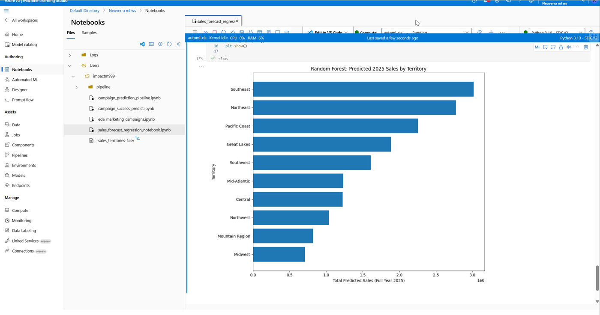
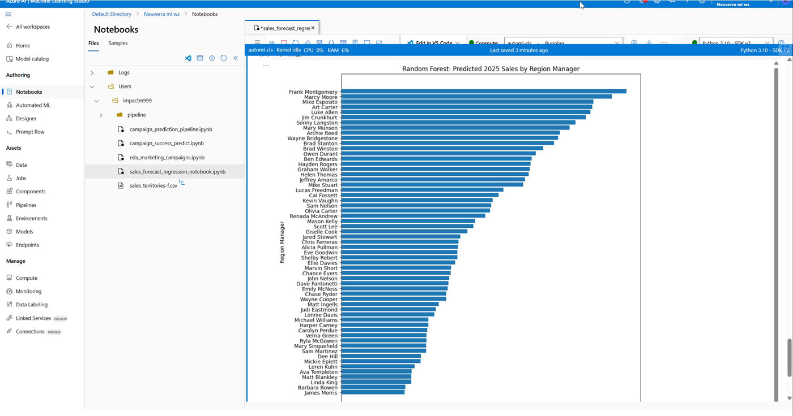
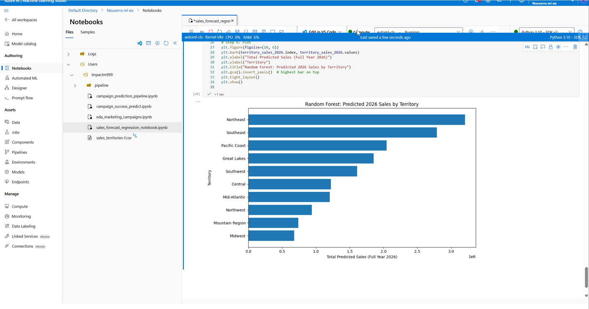
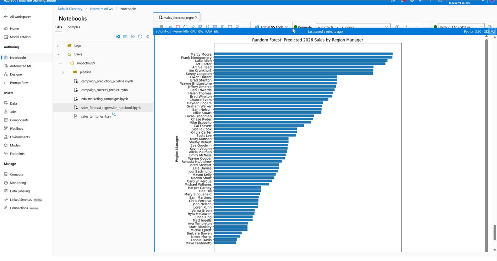

# 📈 Sales Predictive ML — Revenue & Quota Insights  
A mini-project in **Azure ML Studio** that

1. forecasts full-year revenue for 2025 & 2026, and  
2. predicts whether each region manager will hit 2026 quota.

Built for an AI portfolio using **synthetic B2B sales data** from robotics firm **Neuverra**.  
_All dollars, reps, and territories are fictitious._  

---

## 📦 What’s Inside

| File / Notebook                             | Purpose |
|---------------------------------------------|---------|
| `sales_forecast_regression_notebook.ipynb`  | End-to-end walkthrough (data prep → models → charts). |
| `2025-region-stack.jpg` • `2025-rep-stack.jpg` | Top 10 leaderboard plots for 2025 revenue (territory & region manager). |
| `2026-region-stack.jpg` • `2026-rep-stack.jpg` | Same style charts projecting 2026 revenue. |
| `conf_matrix-roc_curve-precision.png` | 2×2 heat-map for quota classifier; ROC curve (AUC≈1.00 on toy data 💀); Precision-Recall curve (AP≈1.00 on toy data).|
| `sales_territories-f.csv`                   | Synthetic dataset (≈60 rows × 21 cols). |

---

## 🧠 Model Summary

| Task | Target | Algorithm | Metric (demo) |
|------|--------|-----------|---------------|
| **2025 Revenue Regression** | `sales_2025_full_year` | ElasticNet, Random Forest | MAE ≈ 107 k |
| **2026 Revenue Regression** | `sales_2026` | Random Forest | MAE ≈ 83 k |
| **Quota Hit Classification** | `quota_hit_2026` (Yes/No) (top 75 % revenue ⇒ Yes) | Random Forest Classifier | ROC-AUC ≈ 1.00 |

> **Why so perfect?** 👉 Data were randomly generated & “shaped” for illustration.  
> Focus is **process competence**, not production accuracy.

Key predictive features:

- Prior-year sales `sales_2024`, `sales_2025`
- Activity mix `active_customers`, `Avg_Deal_Size`
- Historic conversion KPIs (`Lead_Conversion_Rate`, `Quota_Attainment`)

---

## 🛠️ Tech Stack
* Azure Machine Learning Studio (Python 3.10 kernel)  
* Pandas • NumPy • Matplotlib • Seaborn  
* Scikit-learn (ElasticNet, RandomForest[Regressor + Classifier])  

---

## 🗂️ Dataset Notes  
The “raw” CSV was purposefully chaotic (random integers, swapped headers, etc.).  
Steps taken:

1. **Reshape / clean** — drop index col, coerce numerics, fill / drop NA.  
2. **Engineer targets** — YTD → full-year extrapolation, 25th-percentile quota rule.  
3. **Sanity EDA** — histograms & correlation checks (not shown here).

---

## 📊 Sample Visuals

| 2025 Territory | 2025 Reps |
|:---:|:---:|
|  |  |

| 2026 Territory | 2026 Reps |
|:---:|:---:|
|  |  |

Evaluation:

<table>
  <tr>
    <td></td>
    <td></td>
    <td></td>
  </tr>
</table>

